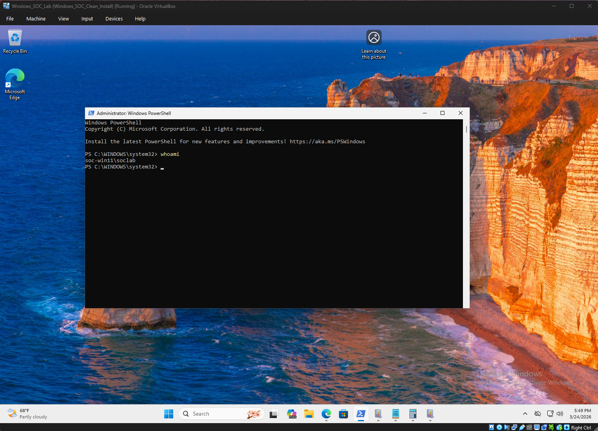
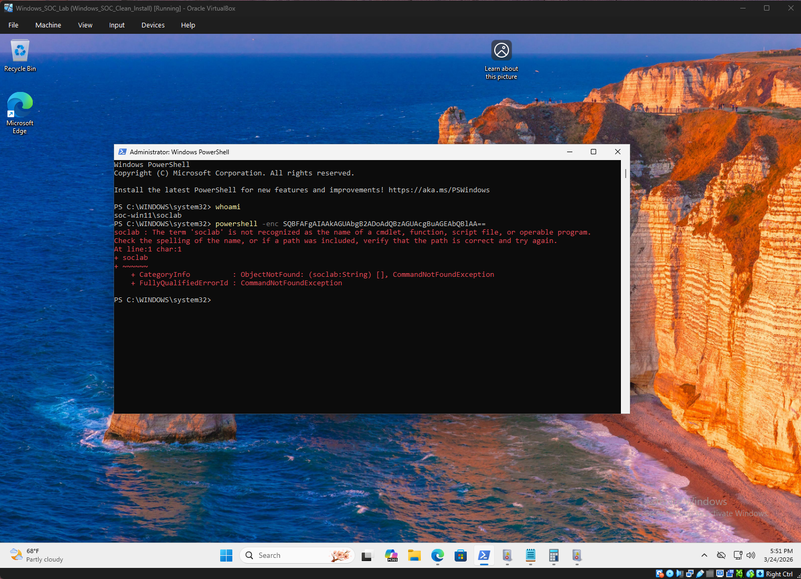
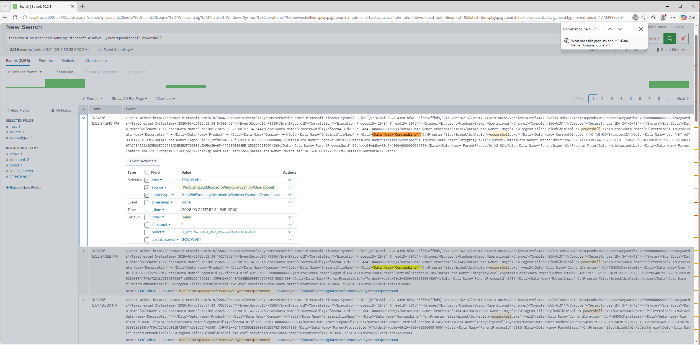
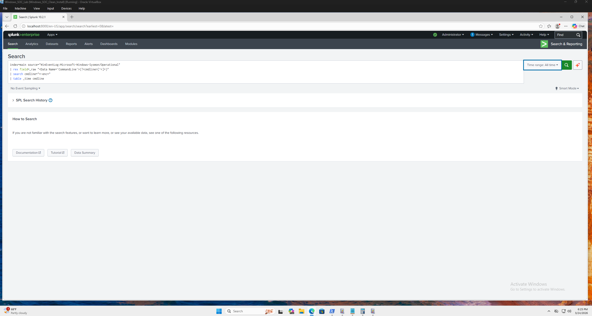
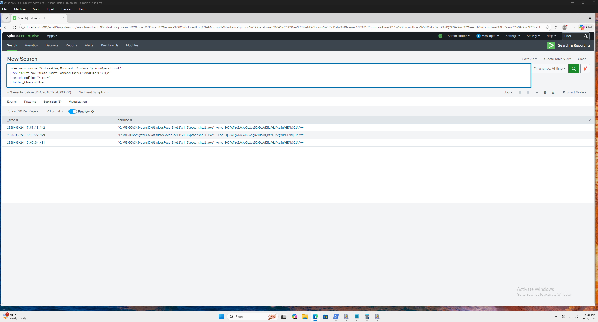

\## 🔍 Encoded PowerShell Detection Lab


\### 📌 Objective


Detect encoded PowerShell execution using Sysmon logs and Splunk.


---


\### 🛠️ Tools Used


\* Windows 11 Virtual Machine

\* Sysmon (SwiftOnSecurity config)

\* Splunk Enterprise

\* PowerShell


---


\### ⚙️ Lab Setup


\* Installed Sysmon with custom configuration

\* Forwarded logs to Splunk

\* Enabled process creation logging (Event ID 1)


---


\### 💀 Attack Simulation


Executed encoded PowerShell command:


```

powershell -enc SQBFAFgAIAAkAGUAbgB2ADoAdQBzAGUAcgBuAGEAbQBlAA==

```


---


\### 🔎 Detection Query


```

index=main source="WinEventLog:Microsoft-Windows-Sysmon/Operational"

| rex field=\_raw "<Data Name='CommandLine'>(?<cmdline>\[^<]+)"

| search cmdline="\*-enc\*"

| table \_time cmdline

```


---


\### 📊 Findings


\* Sysmon captured PowerShell execution

\* Encoded command detected in Splunk

\* Raw logs used for accurate field extraction


---


\### 🚨 Key Takeaways


\* `-enc` is commonly used for obfuscation

\* Raw log analysis is critical

\* Regex helps extract hidden fields


---


\### 📸 Screenshots

#### PowerShell Execution


#### Encoded Command


#### Splunk Raw Event


#### Detection Query


#### Results



