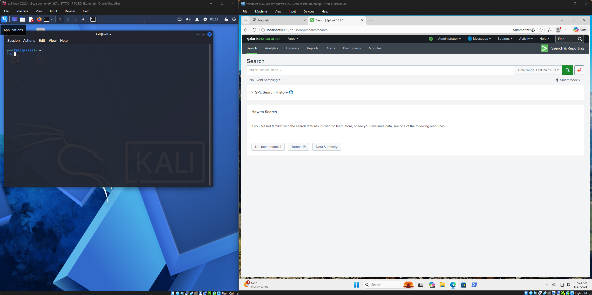
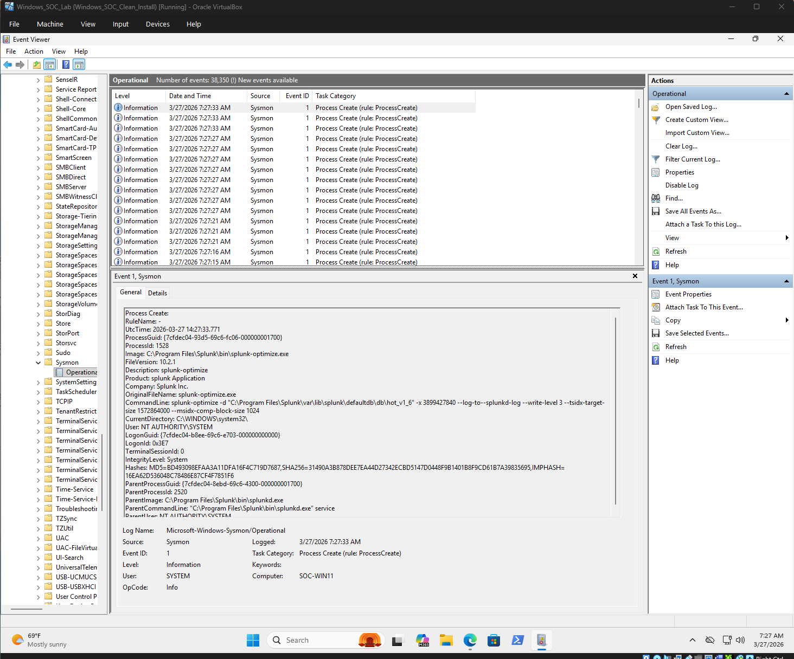
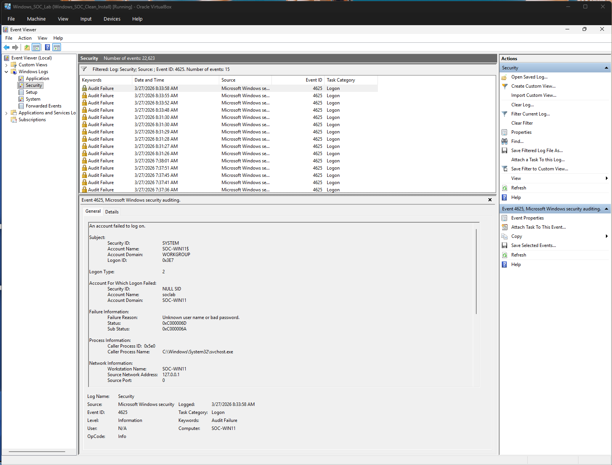
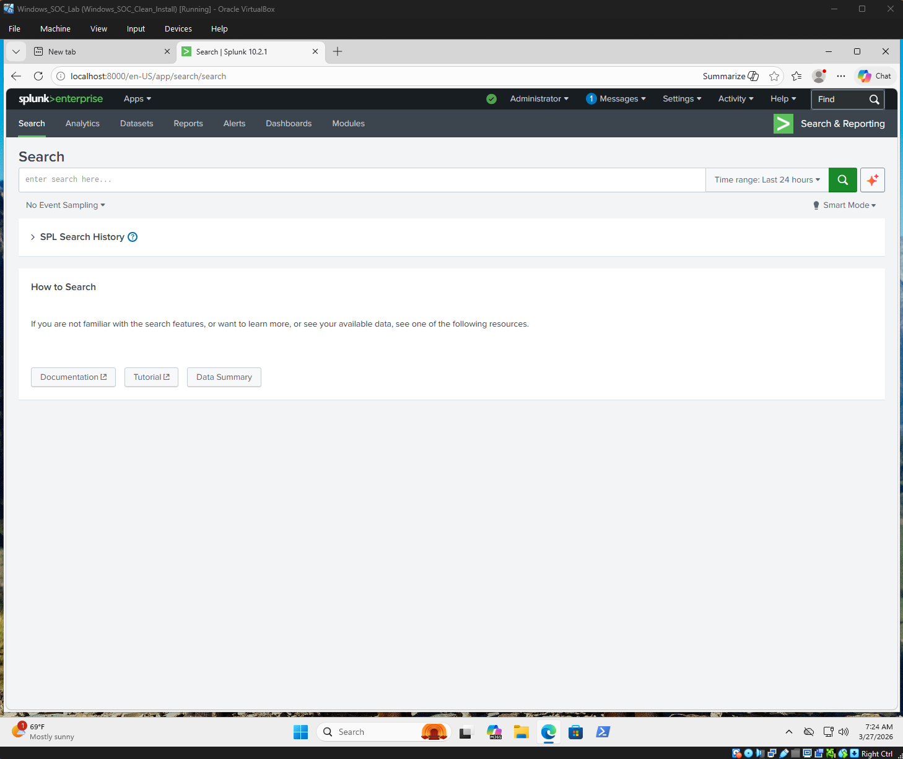
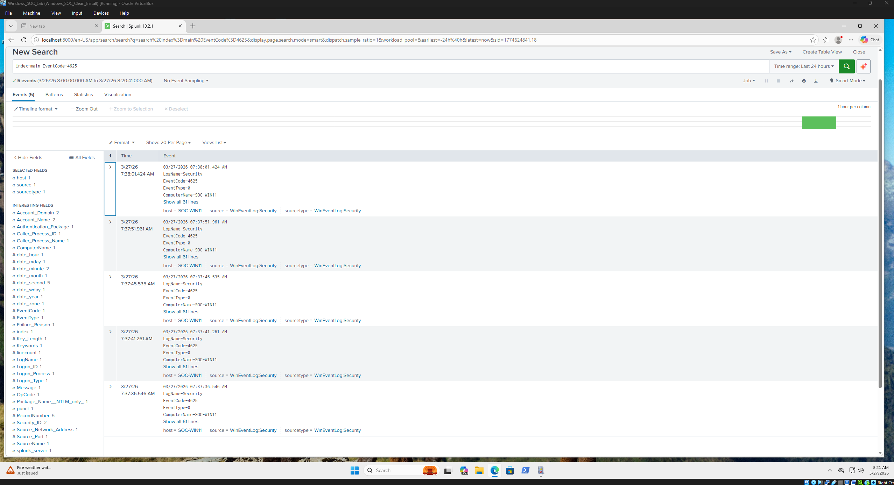
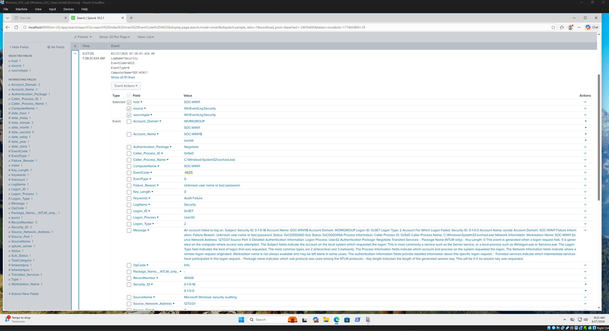
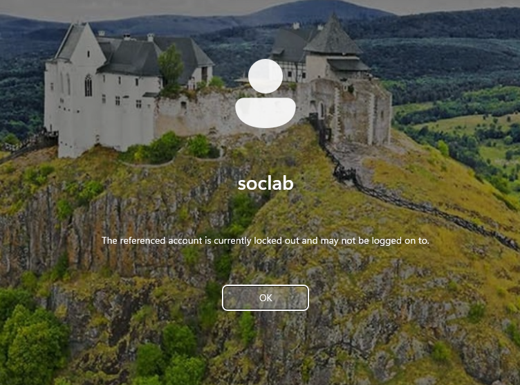
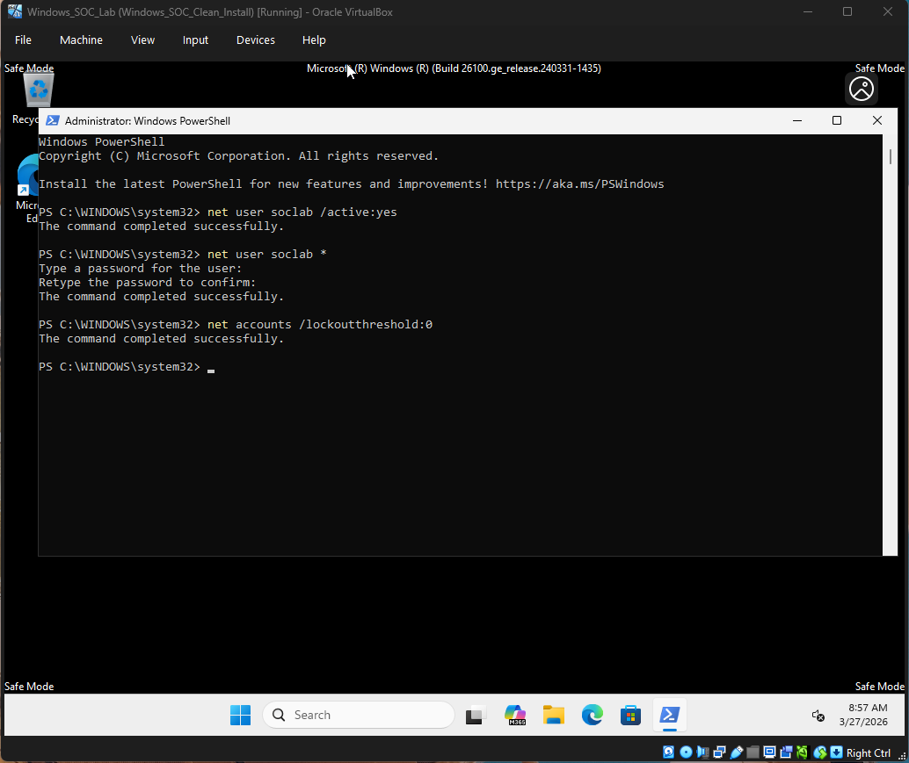

# SOC Lab – Brute Force Detection & Response

## Objective
Simulate and detect a brute force attack using Windows Event Logs, Sysmon, and Splunk SIEM.

---

## Lab Environment
- Windows 11 (Target)
- Kali Linux (Attacker simulation)
- Splunk Enterprise (SIEM)
- Sysmon (Endpoint telemetry)

---

## Attack Simulation
Multiple failed login attempts were generated against a Windows user account (soclab), triggering Event ID 4625.

---

## Detection

### Event Viewer
- Log: Security
- Event ID: 4625
- Result: Multiple failed login attempts (Audit Failure)

### Splunk Query
```
index=main EventCode=4625
```

---

## Analysis
- Repeated authentication failures detected
- Target account: soclab
- Source: Localhost (127.0.0.1)
- Pattern consistent with brute force attack

---

## MITRE ATT&CK Mapping
- T1110 – Brute Force

---

## Impact
- Account locked due to multiple failed login attempts

---

## Response & Remediation
- Accessed system via Safe Mode
- Re-enabled account:
```
net user soclab /active:yes
```
- Reset password
- Disabled lockout threshold:
```
net accounts /lockoutthreshold:0
```

---

## Screenshots











---

## Skills Demonstrated
- Log analysis (Windows Event Logs)
- SIEM investigation (Splunk)
- Threat detection
- Incident response
- MITRE ATT&CK mapping

---

## Summary
This lab demonstrates the detection and response to a brute force attack using real-world SOC workflows, including log analysis, SIEM correlation, and system remediation.
