# Wazuh SOC Lab – Detection and Event Analysis

## Overview

This lab demonstrates a hands-on SOC workflow using Wazuh and Sysmon to monitor and analyze activity on a Windows endpoint.

The goal of this lab was to deploy an endpoint agent, generate telemetry, simulate attacker behavior, and validate that meaningful security events could be detected and investigated through the platform.

---

## Objective

Build and validate a SOC monitoring environment by deploying Wazuh and Sysmon on a Windows endpoint, generating activity, and analyzing resulting security events.

---

### Wazuh Agent Deployment

The Wazuh agent was installed on the Windows endpoint using PowerShell.

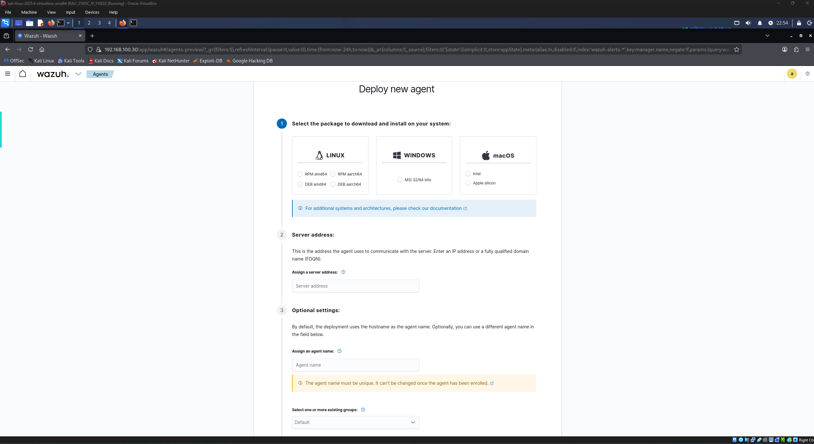

The installation command was generated directly from the Wazuh dashboard and executed on the system.

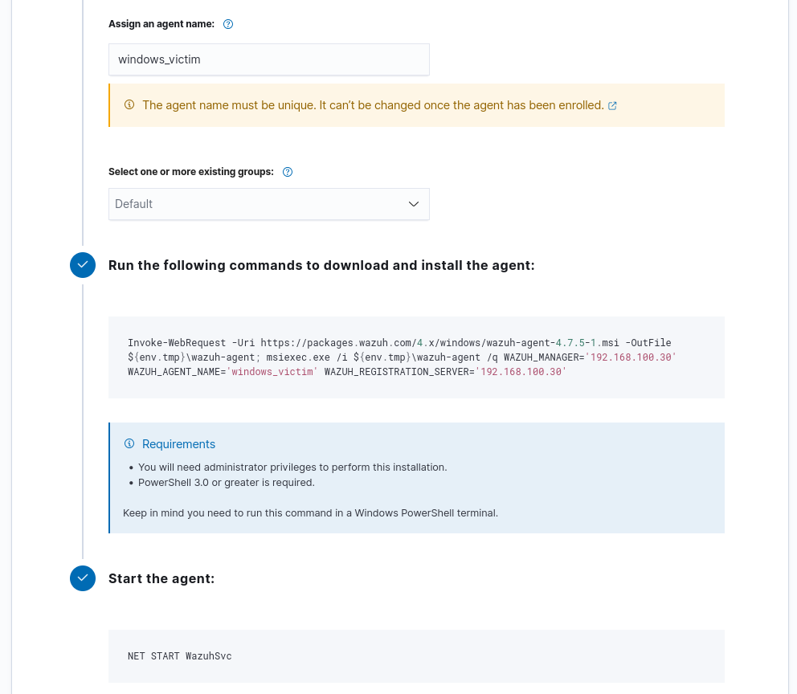

After installation, the agent service was started and verified to be running.

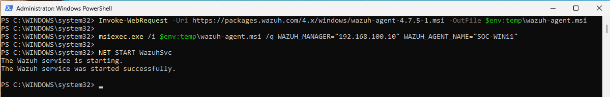

---

### Agent Connectivity

Once installed, the agent successfully connected to the Wazuh manager.

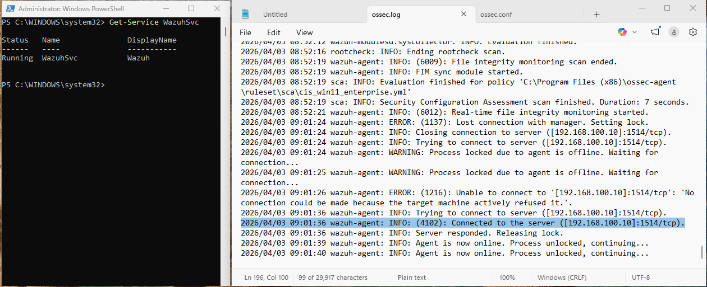

The endpoint appeared as active in the Wazuh dashboard, confirming proper communication between the agent and the manager.

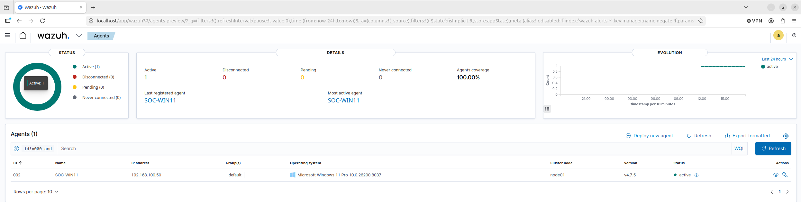

---

### Wazuh Dashboard

The Wazuh dashboard provides centralized visibility into agent status and security activity across the environment.

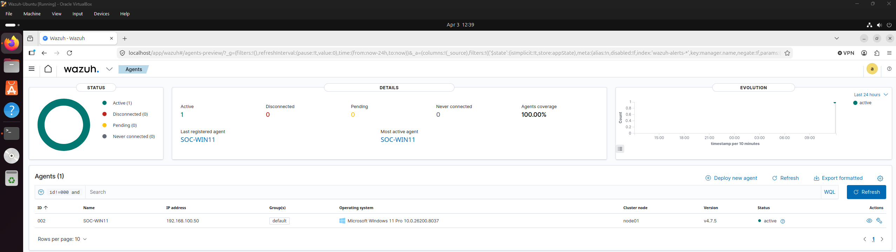

This view highlights alerts and system activity, allowing for quick identification of potential issues.

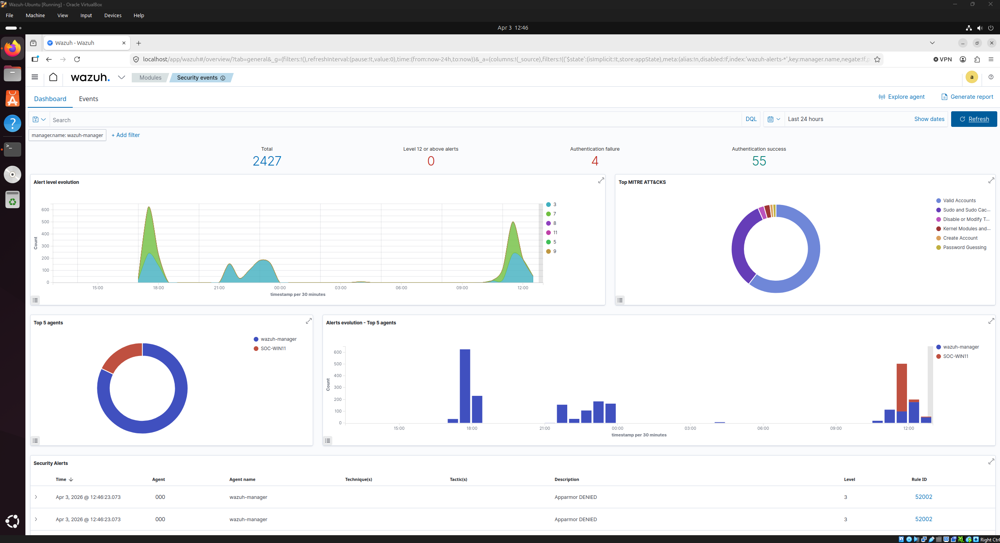

---

### Sysmon Configuration

Sysmon was configured to collect detailed endpoint telemetry, including process creation and file activity.

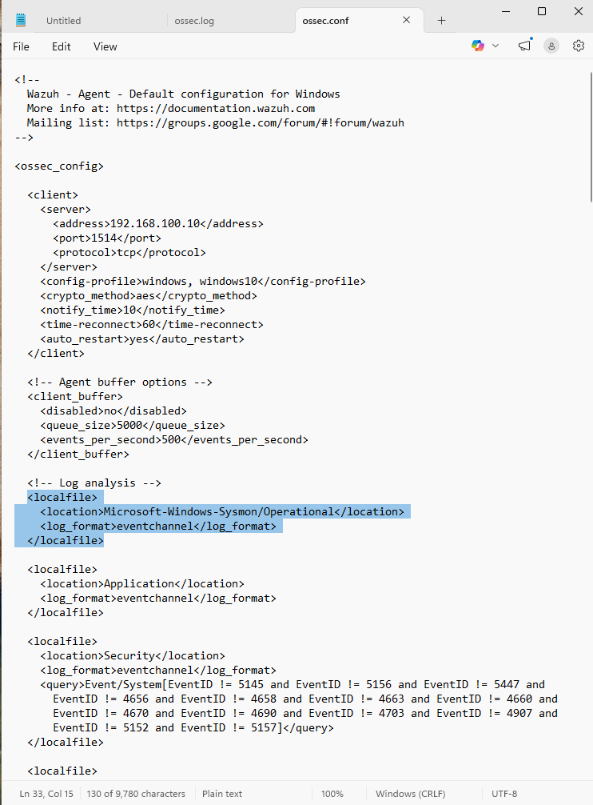

The configuration was applied successfully, and the Sysmon service was verified to be running.

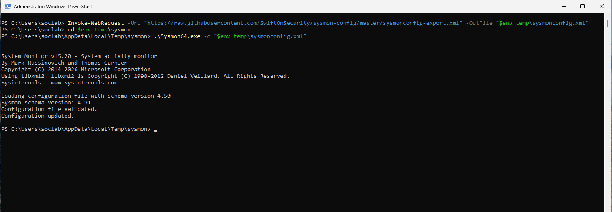

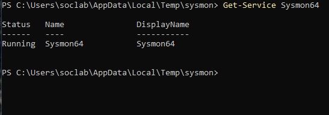

---

### Command Execution Simulation

PowerShell commands were executed on the endpoint to simulate common attacker behavior.

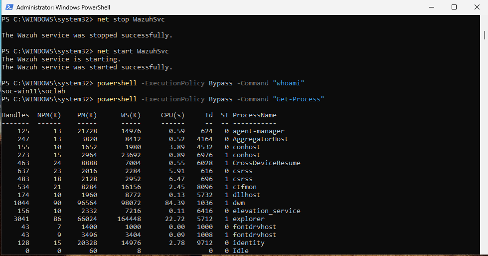

---

### Wazuh Detection

The simulated activity was successfully captured and correlated within Wazuh.

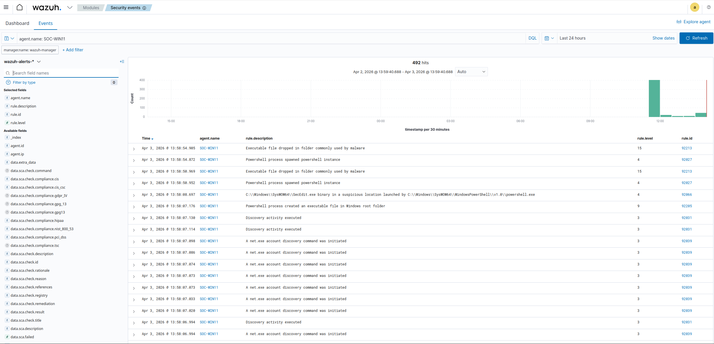

---

### Event Analysis

Alerts were reviewed to understand the actions performed on the system and the context around them.

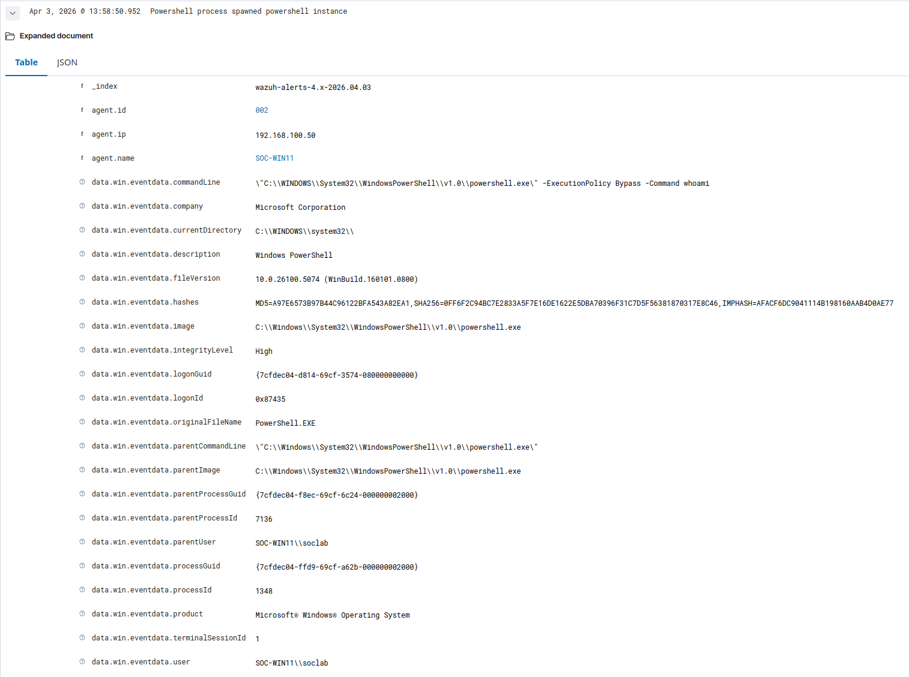

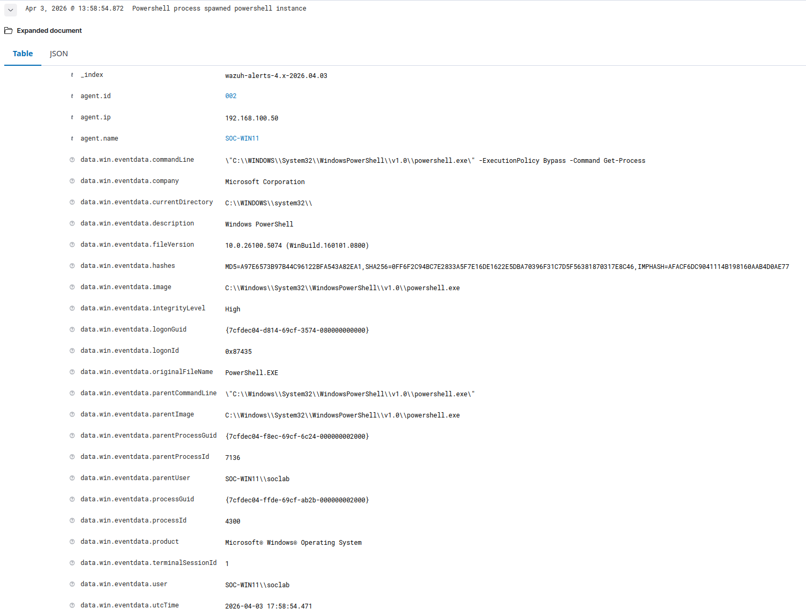

These logs provide visibility into executed commands, associated processes, and user context.

---

### Attack Simulation

A controlled simulation was performed to replicate common attacker behavior and validate detection across different stages.

#### Network Reconnaissance

An Nmap scan was executed from a Kali Linux machine to simulate the reconnaissance phase.

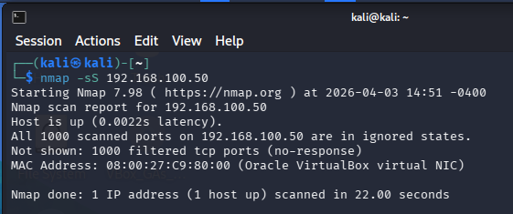

#### Suspicious File Creation

A file was created in a temporary directory to simulate potentially malicious activity.

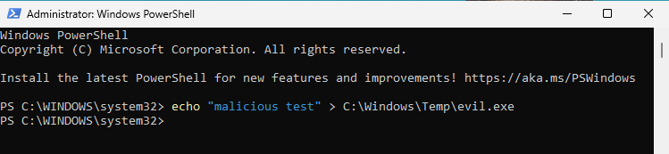

#### Detection in Wazuh

The activity was successfully detected and logged within Wazuh.

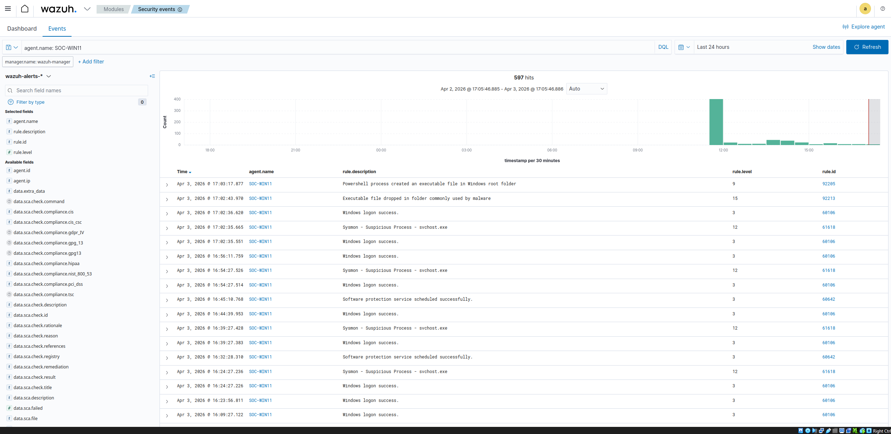

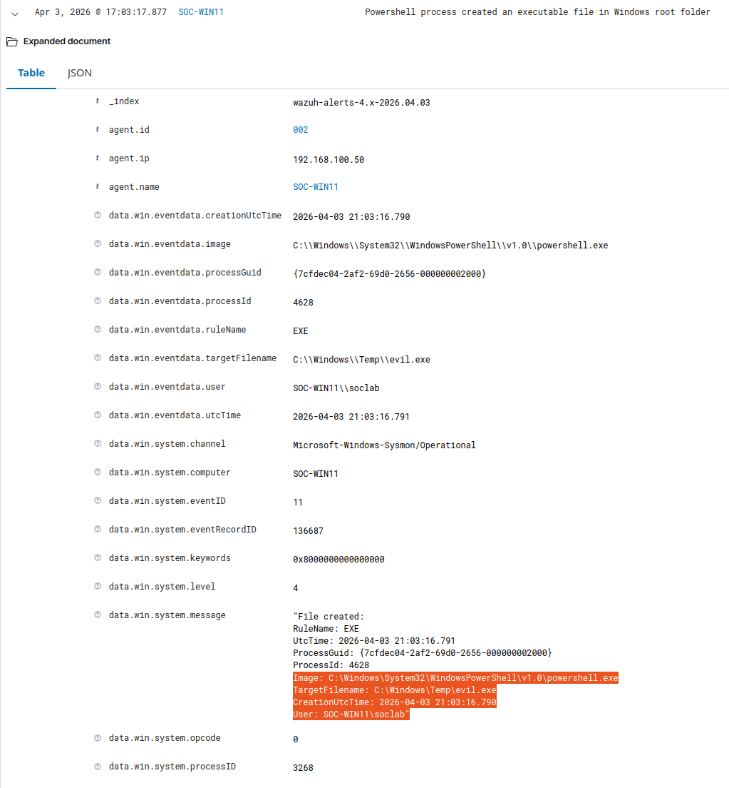

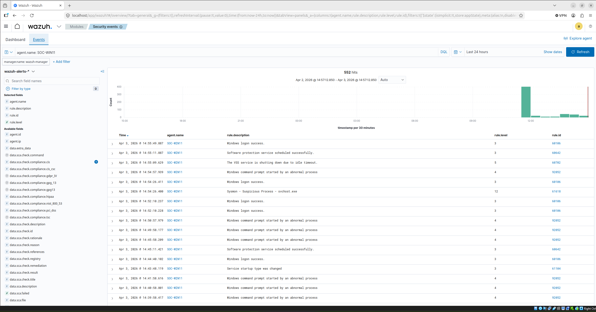

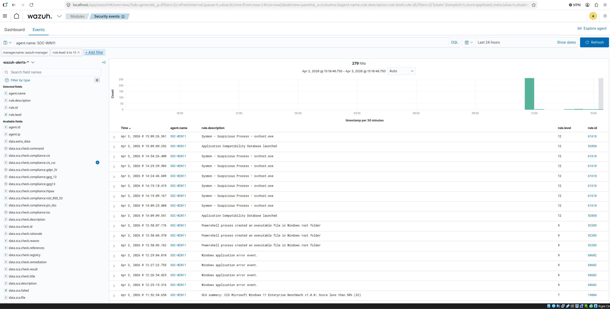

---

## What This Demonstrates

- Deployment and configuration of endpoint monitoring tools (Wazuh, Sysmon)
- Ability to generate and analyze security-relevant events
- Understanding of SOC workflows, including detection and investigation
- Experience working with SIEM-based visibility and alert correlation

---

## Conclusion

This lab demonstrates how combining Wazuh and Sysmon provides strong visibility into endpoint activity and supports effective detection of potentially malicious behavior.

It also reinforces key SOC concepts such as centralized logging, event correlation, and alert analysis.

This environment serves as a foundation for more advanced scenarios, including privilege escalation, lateral movement, and persistence, which will be explored in future labs.
